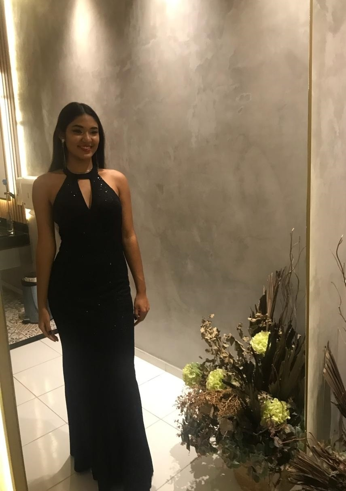

  

Olá, pessoal, eu sou a Raquel Aparecida, a debutante mais linda e simpática que vocês já viram. Hoje eu vou contar um pouco mais sobre mim.
Então, vamos lá!

  &nbsp;&nbsp;&nbsp;&nbsp;&nbsp;&nbsp;&nbsp;&nbsp;

Eu nasci em 17 de abril de 2009, na terra dos verdes canaviais, mas eu não sou uma cana-de-açúcar, eu sou uma flor. Uma flor lilás, porque essa é a minha cor preferida. Eu acho que combina com a minha personalidade, que é doce, delicada e misteriosa. 

  &nbsp;&nbsp;&nbsp;&nbsp;&nbsp;&nbsp;&nbsp;&nbsp;

Sou muito espiritualizada e intuitiva, mas também sou muito estudiosa. Eu adoro estudar, principalmente as matérias que têm números, como matemática, gosto de decorar os meus cadernos com adesivos, canetas coloridas e desenhos, para deixar tudo mais divertido e fácil de lembrar. 

  &nbsp;&nbsp;&nbsp;&nbsp;&nbsp;&nbsp;&nbsp;&nbsp;

Sou quase uma sereia, porque o meu hobby favorito é nadar. Eu amo a água, eu me sinto em casa, quando estou na piscina. Eu participo de várias competições escolares de natação, tento ser muito rápida e ágil. Mas eu não sou só velocista , eu também sou cuidado e proteção. Eu uso óculos de natação, protetor solar, touca, tudo para preservar a minha saúde e a minha beleza. Eu não sou muito vaidosa, mas eu gosto de me cuidar, porque eu sei que a beleza vem de dentro, mas também se reflete por fora.

  &nbsp;&nbsp;&nbsp;&nbsp;&nbsp;&nbsp;&nbsp;&nbsp;  
  &nbsp;&nbsp;&nbsp;&nbsp;&nbsp;&nbsp;&nbsp;&nbsp;  
  

O meu segundo hobby é fazer crochê. Eu sei, parece coisa de vó, mas eu acho muito legal e relaxante. Gosto de usar cores diferentes e vibrantes, para alegrar o meu dia. Tenho um gosto eclético, eu misturo as linhas sem medo de errar. Eu também misturo músicas, eu faço o meu crochê ao som de Scorpions, MPB e rock nacional. Eu sou uma roqueira, uma brasileira, uma cidadã do mundo. Eu gosto de tudo um pouco, e de tudo muito.

  &nbsp;&nbsp;&nbsp;&nbsp;&nbsp;&nbsp;&nbsp;&nbsp;

O voleibol é o meu outro hobby, eu também adoro jogar bola, gosto de estar na quadra com os meus amigos, jogando, rindo, brincando, e claro, ganhando, kkk.  Eu jogo com garra, com vontade, com paixão. Eu libero as tensões do cotidiano com a bola e celebro as minhas vitórias com os meus companheiros. 

  &nbsp;&nbsp;&nbsp;&nbsp;&nbsp;&nbsp;&nbsp;&nbsp;  

Nos finais de semana, eu gosto de sair com a minha família, que é a minha base, o meu alicerce, o meu porto seguro. Eu amo os meus pais, a minha irmãzinha, os meus tios, os meus primos, os meus avós. Eu sou uma pessoa muito amorosa, eu tenho amor de sobra para dar e receber. Nesses momentos, em que saio para passear com a minha família, eu aproveito para me arrumar bastante, para ficar ainda mais bonita e atraente. Eu coloco anéis, pulseiras, colar, brinco, faço uma make para realçar a minha essência, sempre me arrumando do pé à cabeça. 

  &nbsp;&nbsp;&nbsp;&nbsp;&nbsp;&nbsp;&nbsp;&nbsp;  
  

Nos feriados prolongados, eu sempre vou ao sítio com a minha família, para ter um contato mais próximo com a natureza. Eu adoro respirar o ar puro, sentir o cheiro da terra molhada, ouvir o som das vacas, ver o nascer e o pôr do sol, contemplar as estrelas, colher as frutas subindo nas árvores, regar as flores, alimentar os animais, tomar banho de açude… Eu também sou uma menina do campo…

  &nbsp;&nbsp;&nbsp;&nbsp;&nbsp;&nbsp;&nbsp;&nbsp;  
  &nbsp;&nbsp;&nbsp;&nbsp;&nbsp;&nbsp;&nbsp;&nbsp;  
  

Hoje eu estou debutando, entrando em uma nova fase da minha vida, e cada vez mais focada em realizar o meu sonho de concluir o ensino médio, dar início e concluir o meu curso superior favorito e com as graças de Deus e de Nossa Senhora Aparecida eu irei realizar. Eu sou uma sonhadora, uma idealista, uma realizadora. 

  

Agradeço por todo o carinho e apoio demonstrados ao longo desta jornada. Que este espaço tenha sido não apenas informativo, mas também inspirador e motivador para todos que passaram por aqui. Que possamos continuar construindo laços de amizade e compartilhando experiências incríveis juntos.

 

---
  

  &nbsp;&nbsp;&nbsp;&nbsp;&nbsp;&nbsp;&nbsp;&nbsp;  
  &nbsp;&nbsp;&nbsp;&nbsp;&nbsp;&nbsp;&nbsp;&nbsp;  
  &nbsp;&nbsp;&nbsp;&nbsp;&nbsp;&nbsp;&nbsp;&nbsp;  
  &nbsp;&nbsp;&nbsp;&nbsp;&nbsp;&nbsp;&nbsp;&nbsp;  
  &nbsp;&nbsp;&nbsp;&nbsp;&nbsp;&nbsp;&nbsp;&nbsp;  
  &nbsp;&nbsp;&nbsp;&nbsp;&nbsp;&nbsp;&nbsp;&nbsp;  
    
    
    
  &nbsp;&nbsp;&nbsp;&nbsp;&nbsp;&nbsp;&nbsp;&nbsp;  
    
  &nbsp;&nbsp;&nbsp;&nbsp;&nbsp;&nbsp;&nbsp;&nbsp;  
  
  
  

